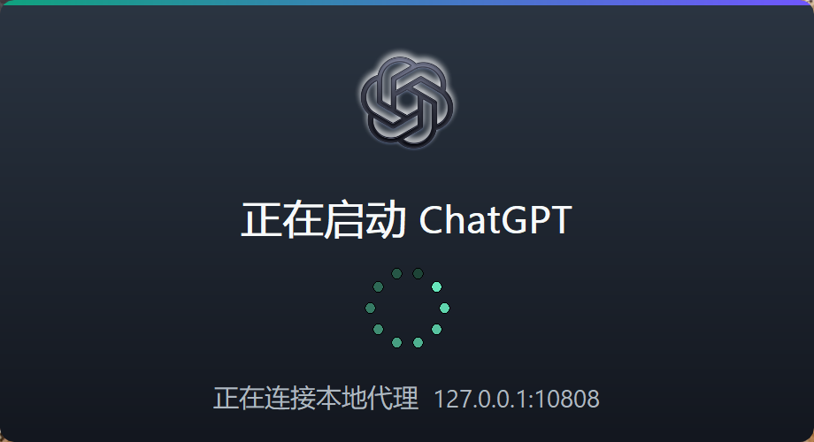
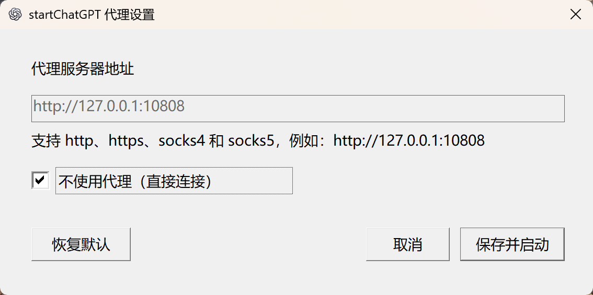

# startChatGPT

[](LICENSE)
[](https://github.com/wenxingyu/startChatGPT/actions/workflows/build.yml)

一个轻量级 Windows 启动器：自动找到最新版 `OpenAI.Codex` 中的 ChatGPT，并使用你保存的代理
设置启动。ChatGPT 升级、安装目录变化后，不需要重新修改快捷方式。

## 功能

- 自动寻找最新版本的 ChatGPT，无需维护 WindowsApps 版本目录
- 默认使用 `http://127.0.0.1:10808`
- 支持保存 HTTP、HTTPS、SOCKS4 和 SOCKS5 代理地址
- 支持不使用代理直接连接
- 支持命令行临时覆盖代理设置
- 原生 Windows Splash 动画，ChatGPT 主窗口出现后自动消失
- 单文件运行，不需要安装 Rust 或其他运行库



## 下载与使用

1. 前往 [Releases](https://github.com/wenxingyu/startChatGPT/releases/latest) 下载
   `startChatGPT.exe`。
2. 如果你的本地代理地址是默认的 `http://127.0.0.1:10808`，直接双击即可启动 ChatGPT。
3. 如果需要修改代理，按住键盘上的 **Shift**，同时双击 `startChatGPT.exe`。
4. 在设置窗口中输入代理地址，然后点击 **保存并启动**。设置会被记住，以后直接双击即可。
5. 如果不需要代理，勾选 **不使用代理（直接连接）**，再点击 **保存并启动**。



设置保存在 `%APPDATA%\startChatGPT\config.txt`，不会因为 ChatGPT 升级而丢失。

## Code signing policy

项目正在申请 SignPath Foundation 的免费开源代码签名。申请获批前，Release
中的程序仍是未签名版本。签名流程、团队角色与隐私说明请参阅
[Code signing policy](CODE_SIGNING_POLICY.md)。

计划采用的签名服务声明：Free code signing provided by SignPath.io,
certificate by SignPath Foundation。

## 隐私

启动器不收集分析数据或遥测信息。代理设置只保存在本机；只有用户明确启动
ChatGPT 时，程序才会按照用户选择的连接方式启动本机已安装的 ChatGPT。

## 命令行用法

打开代理设置窗口：

```powershell
.\startChatGPT.exe --settings
```

临时使用其他代理，但不修改已经保存的设置：

```powershell
.\startChatGPT.exe --proxy=http://127.0.0.1:7890
```

临时不使用代理：

```powershell
.\startChatGPT.exe --no-proxy
```

其他未被启动器识别的参数会继续传递给 ChatGPT。

## 从源码编译

```powershell
cd C:\Code\ontology\startChatGPT-rust
.\build.ps1
```

Release 配置针对体积优化：完整 LTO、单 codegen unit、`panic = "abort"` 并移除符号。
ChatGPT 官方图标通过项目内的 Windows 资源对象嵌入。

## 许可证

本项目采用 [MIT License](LICENSE)。
