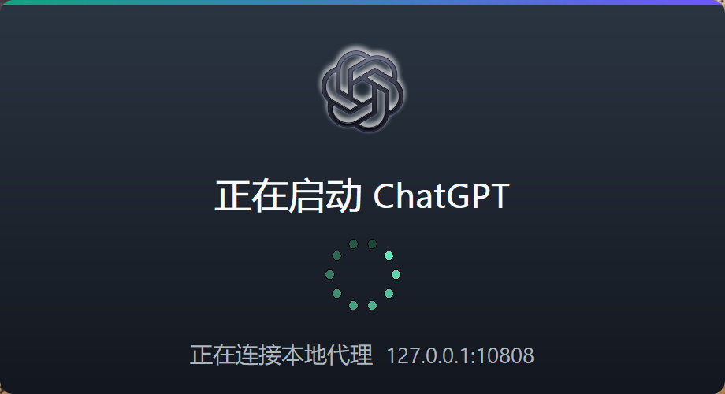
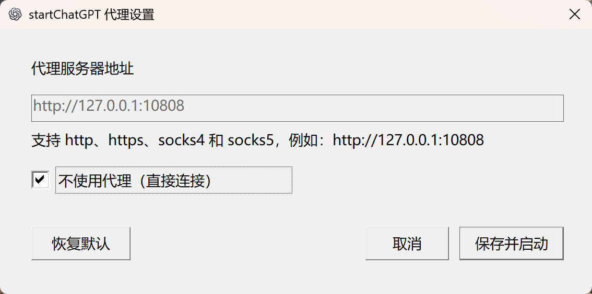

# startChatGPT

[](LICENSE)
[](https://github.com/wenxingyu/startChatGPT/actions/workflows/build.yml)

一个轻量级 Windows / macOS 启动器，使用你保存的代理设置启动 ChatGPT/Codex，
并显示当前 Codex CLI 账户的剩余额度。

Windows 版自动找到最新版 `OpenAI.Codex` 中的 ChatGPT，升级后不需要重新修改快捷方式。
启动器读取当前用户注册的应用包，通过 Windows 应用激活接口启动 ChatGPT 并传递代理参数。
不会直接运行 WindowsApps 中的 EXE，避免新版 ChatGPT 报“该进程没有程序包标识符”。

macOS 版使用原生 AppKit 设置窗口和菜单栏额度显示，查找 `/Applications` 或
`~/Applications` 中的 `ChatGPT.app`。
通过 macOS 应用启动接口传递代理参数和环境变量。

## 功能

- 自动寻找最新版本的 ChatGPT，无需维护 WindowsApps 版本目录
- 默认使用 `http://127.0.0.1:10808`
- 支持保存 HTTP、HTTPS、SOCKS4 和 SOCKS5 代理地址
- 支持不使用代理直接连接
- 支持命令行临时覆盖代理设置
- 原生 Windows Splash 动画，ChatGPT 主窗口出现后自动消失
- EXE 内嵌产品名称、版本、作者和版权等 Windows 文件信息
- 单文件运行，不需要安装 Rust 或其他运行库
- 启动后常驻显示 Codex 两个额度周期的剩余百分比，每 45 秒刷新
- 空闲时主动释放托盘绘制和额度服务的工作集，降低常驻物理内存占用
- 使用 Windows 事件监听额度更新和 Codex 退出，空闲时不进行周期轮询

## Codex 额度显示

默认在 Windows 系统托盘中显示一个数字图标，数字为短期（通常 5 小时）剩余百分比。
每 45 秒读取额度。悬停可看短期和每周额度；左键打开重置时间等详情，右键可刷新或退出。
Windows 可能将新图标放入“∧”折叠区域，可手动拖到常显区域。
本版使用真正的系统托盘图标，由 Windows 排列，不会覆盖任务栏按钮。
支持高 DPI 缩放，按托盘所在屏幕重新生成图标；重复点击只会唤起一个详情窗口。

也可通过 `--usage-widget` 启动双行小窗，标签使用 `5H / 1W`。

绿色表示额度充足，剩余不超过 25% 时显示黄色，不超过 10% 时显示红色。
读取失败时图标变灰，保留上次数字并在悬停提示中标记过期；没有数据时显示 `--`。
窗口内数字表示当前登录的 **Codex CLI 账户**额度，CLI 与桌面端需使用同一个账户。

额度读取依赖本机可运行且已登录的 Codex CLI。程序会寻找 npm 安装的 CLI、
PATH 中的 `codex.exe` 和桌面端附带的 CLI，也可通过 `STARTCHATGPT_CODEX_EXE`
指定可执行文件。商店版附带的 CLI 在部分机器上可能无法直接运行。
程序通过官方 app-server 协议读取额度，不会创建任务或发起模型对话，
不会读取、复制或记录登录令牌。额度请求沿用已保存的代理设置。

只打开额度托盘（不重复启动桌面端）：

```powershell
.\startChatGPT.exe --usage-only
```

退出额度显示不会关闭 Codex；通过本启动器打开 Codex 时，关闭 Codex 后额度显示也会自动退出。
使用 `--usage-only` 独立打开的额度托盘仍会持续运行，可从右键菜单退出。



## Windows 下载与使用

1. 前往 [Releases](https://github.com/wenxingyu/startChatGPT/releases/latest) 下载
   `startChatGPT.exe`。
2. 如果你的本地代理地址是默认的 `http://127.0.0.1:10808`，直接双击即可启动 ChatGPT。
3. 如果需要修改代理，按住键盘上的 **Shift**，同时双击 `startChatGPT.exe`。
4. 在设置窗口中输入代理地址，然后点击 **保存并启动**。设置会被记住，以后直接双击即可。
5. 如果不需要代理，勾选 **不使用代理（直接连接）**，再点击 **保存并启动**。



设置保存在 `%APPDATA%\startChatGPT\config.txt`，不会因为 ChatGPT 升级而丢失。

## macOS 使用

从 1.3.0 起，[Releases](https://github.com/wenxingyu/startChatGPT/releases/latest)
同时提供 macOS 安装包：Apple Silicon 下载 `startChatGPT-macos-aarch64.zip`，
Intel 下载 `startChatGPT-macos-x86_64.zip`。macOS 版目前处于适配验证阶段；
启动器最低要求 macOS 11，目标桌面应用仍需满足其自身的系统要求。

解压对应架构的 ZIP，将 `startChatGPT.app` 放入 Applications 后双击启动 ChatGPT。
应用包包含与 Windows 版一致的 ChatGPT 图标。
首次使用默认代理 `http://127.0.0.1:10808`，顶部菜单栏显示短期剩余额度，
点击可看两个周期的额度和重置时间、刷新或退出额度显示。
退出额度显示不会关闭桌面端；正常启动模式下，桌面端完全退出后额度显示也会退出。
额度显示只运行一个实例，重复打开不会新增菜单栏图标。

修改代理设置（Mac 版通过命令行打开设置窗口）：

```bash
"/Applications/startChatGPT.app/Contents/MacOS/startChatGPT" --settings
```

临时覆盖代理、不使用代理、只显示额度、打开额度小窗：

```bash
"/Applications/startChatGPT.app/Contents/MacOS/startChatGPT" --proxy=http://127.0.0.1:7890
"/Applications/startChatGPT.app/Contents/MacOS/startChatGPT" --no-proxy
"/Applications/startChatGPT.app/Contents/MacOS/startChatGPT" --usage-only
"/Applications/startChatGPT.app/Contents/MacOS/startChatGPT" --usage-widget
```

`--usage-only` 和 `--usage-widget` 不启动桌面端，也可以在未安装桌面端时使用，
但必须安装并登录 Codex CLI。Mac 版支持命令行代理覆盖同时作用于额度服务。
配置保存在 `~/Library/Application Support/startChatGPT/config.txt`。
Mac 版暂未实现 Windows 版的启动动画和 Shift 双击设置入口。

桌面端已运行时，新的参数和环境变量不能重新应用；启动器会提示先完全退出
ChatGPT，再通过启动器打开。启动器不会强制结束桌面端进程。
代理参数及环境变量是否被当前桌面端的所有网络请求采用，仍需实际验证，
请参阅 [Mac 验证清单](docs/macos-testing.md)。

自定义桌面端位置或 Codex CLI 位置：

```bash
STARTCHATGPT_APP_PATH="$HOME/Applications/ChatGPT.app" \
  "/Applications/startChatGPT.app/Contents/MacOS/startChatGPT"
STARTCHATGPT_CODEX_EXE="/opt/homebrew/bin/codex" \
  "/Applications/startChatGPT.app/Contents/MacOS/startChatGPT" --usage-only
```

Finder 启动时的 PATH 可能和终端不同。启动器额外寻找 Homebrew、`~/.npm-global/bin`、
`~/.local/bin` 和桌面端内附带的 CLI；自定义安装可使用上述环境变量。
macOS 构建仅有本地 ad hoc 签名，尚未做 Developer ID 签名与公证；系统可能阻止
首次打开。确认下载来源后，可以在系统设置的“隐私与安全性”中允许打开。

## Code signing policy

项目正在申请 SignPath Foundation 的免费开源代码签名。申请获批前，Release
中的程序仍是未签名版本。签名流程、团队角色与隐私说明请参阅
[Code signing policy](CODE_SIGNING_POLICY.md)。

计划采用的签名服务声明：Free code signing provided by SignPath.io,
certificate by SignPath Foundation。

## 隐私

启动器不收集分析数据或遥测信息。代理设置只保存在本机。启动时程序按用户选择的
连接方式启动本机 ChatGPT，并通过本机 Codex CLI 定期向 Codex 服务请求账户额度。

## 命令行用法

打开代理设置窗口：

```powershell
.\startChatGPT.exe --settings
```

临时使用其他代理，但不修改已经保存的设置：

```powershell
.\startChatGPT.exe --proxy=http://127.0.0.1:7890
```

临时不使用代理：

```powershell
.\startChatGPT.exe --no-proxy
```

其他未被启动器识别的参数会继续传递给 ChatGPT。

## 从源码编译

Windows：

```powershell
cd C:\Code\startChatGPT
.\build.ps1
```

Release 配置针对体积优化：完整 LTO、单 codegen unit、`panic = "abort"` 并移除符号。
构建脚本会从 `Cargo.toml` 自动生成 Windows 文件版本，并与 ChatGPT 图标一起嵌入 EXE。

macOS（需要 Rust 和 Xcode Command Line Tools）：

```bash
bash ./build-macos.sh aarch64-apple-darwin   # Apple Silicon
bash ./build-macos.sh x86_64-apple-darwin   # Intel
```

输出位于 `target/<架构>/release/startChatGPT.app` 和同目录下的 ZIP。
脚本构建 Rust 启动器和 Swift AppKit 界面组件；在与目标架构相同的 Mac 上，还会运行
Rust 测试和原生组件自检。Windows 和 macOS 共用代理解析、命令行参数和额度服务，
平台启动与界面分别实现。

源码按共享功能与平台实现组织，模块职责、依赖边界和测试方式见
[代码结构说明](docs/architecture.md)。

## 许可证

本项目采用 [MIT License](LICENSE)。
